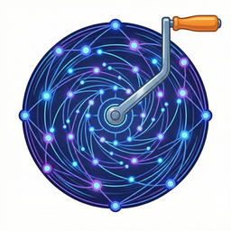

> **Both Packages Required:** Flywheel-Crank (11 mutation tools) requires [Flywheel](https://github.com/velvetmonkey/flywheel) (51 read-only tools) for the complete experience. See the [Platform Installation Guide](docs/INSTALL.md) for your OS.

<div align="center">
  
</div>

# Flywheel Crank

### Surgical vault mutations for Claude

[](https://modelcontextprotocol.io/)
[](https://github.com/velvetmonkey/flywheel-crank/actions/workflows/ci.yml)
[](https://www.npmjs.com/package/@velvetmonkey/flywheel-crank)
[](https://www.apache.org/licenses/LICENSE-2.0)
[](https://github.com/velvetmonkey/flywheel-crank)
[](./docs/BENCHMARK_RESULTS.md)

Give Claude deterministic write access to your Obsidian vault with auto-wikilinks, atomic commits, and full undo.

---

## What Crank Does

| Tool | What It Does | Example Use Case |
|------|--------------|------------------|
| `vault_add_to_section` | Add content to a markdown section | Log entries, journal updates |
| `vault_remove_from_section` | Remove matching lines from section | Clean up completed items |
| `vault_replace_in_section` | Find and replace in section | Fix typos, update references |
| `vault_toggle_task` | Check/uncheck a task | Mark tasks complete |
| `vault_add_task` | Add a new task to a section | Add to-dos with due dates |
| `vault_update_frontmatter` | Update YAML fields | Set status, add tags |
| `vault_add_frontmatter_field` | Add new frontmatter field | Initialize metadata |
| `vault_create_note` | Create new note with template | New project, meeting note |
| `vault_delete_note` | Delete a note (with confirmation) | Archive cleanup |
| `vault_move_note` | Move note, update backlinks | Reorganization |
| `vault_rename_note` | Rename note, update backlinks | Naming consistency |

---

## Quick Start

Add to your Claude Code MCP config (`.mcp.json`):

```json
{
  "mcpServers": {
    "flywheel": {
      "command": "npx",
      "args": ["-y", "@velvetmonkey/flywheel-mcp"]
    },
    "flywheel-crank": {
      "command": "npx",
      "args": ["-y", "@velvetmonkey/flywheel-crank"]
    }
  }
}
```

> **Windows:** Use `"command": "cmd", "args": ["/c", "npx", "-y", "@velvetmonkey/flywheel-crank"]`

---

## See The Tools In Action

### Add to Daily Log

**Prompt:** "Log that I discussed the API design with Sarah"

**Tool call:**
```json
{
  "tool": "vault_add_to_section",
  "path": "daily-notes/2026-02-06.md",
  "section": "## Log",
  "content": "Discussed API design with Sarah",
  "format": "timestamp-bullet"
}
```

**Result:**
```markdown
## Log
- 14:32 Discussed API design with [[Sarah Chen]]
  → [[API Design]] [[Architecture Decisions]]
```

Auto-wikilinks detected "Sarah" and linked to `[[Sarah Chen]]`. The contextual cloud `→ [...]` suggests related topics.

---

### Toggle Task

**Prompt:** "Mark the budget review task as done"

**Tool call:**
```json
{
  "tool": "vault_toggle_task",
  "path": "projects/Q2 Planning.md",
  "taskText": "Review budget",
  "checked": true
}
```

**Before:**
```markdown
## Tasks
- [ ] Review budget
- [ ] Schedule kickoff
```

**After:**
```markdown
## Tasks
- [x] Review budget
- [ ] Schedule kickoff
```

---

### Update Frontmatter

**Prompt:** "Set the project status to complete"

**Tool call:**
```json
{
  "tool": "vault_update_frontmatter",
  "path": "projects/Website Redesign.md",
  "updates": { "status": "complete", "completed": "2026-02-06" }
}
```

**Result:**
```markdown
---
type: project
status: complete
completed: 2026-02-06
---
```

---

### Create Note

**Prompt:** "Create a meeting note for tomorrow's sync"

**Tool call:**
```json
{
  "tool": "vault_create_note",
  "path": "meetings/2026-02-07 Team Sync.md",
  "content": "# Team Sync\n\n## Attendees\n\n## Agenda\n\n## Notes\n",
  "frontmatter": { "type": "meeting", "date": "2026-02-07" }
}
```

---

## Combining Tools: Policies

For repeatable multi-step workflows, define a **policy**:

```yaml
# .claude/policies/onboard-project.yaml
version: "1.0"
name: onboard-project
description: Standard workflow for new client projects

variables:
  name:
    type: string
    required: true
  client:
    type: string
    required: true
  budget:
    type: number
    required: true

steps:
  - id: create-project
    tool: vault_create_note
    params:
      path: "projects/{{name}}.md"
      frontmatter:
        type: project
        client: "[[{{client}}]]"
        budget: "{{budget}}"
        status: active

  - id: update-client
    tool: vault_add_to_section
    params:
      path: "clients/{{client}}.md"
      section: "## Active Projects"
      content: "- [[{{name}}]] - ${{budget}}"

  - id: log-daily
    tool: vault_add_to_section
    params:
      path: "daily-notes/{{today}}.md"
      section: "## Log"
      content: "Onboarded [[{{name}}]] project"
      format: timestamp-bullet
      suggestOutgoingLinks: true
```

**Execute:**
```
You: Onboard new project: Acme Website, client Acme Corp, budget 45000
Claude: Running onboard-project...
  ✓ vault_create_note → projects/Acme Website.md
  ✓ vault_add_to_section → clients/Acme Corp.md
  ✓ vault_add_to_section → daily-notes/2026-02-06.md
```

**Benefits:**
- **Atomic:** All steps commit together
- **Reversible:** One undo reverts everything
- **Auditable:** YAML lives in git

See [Policy Guide](./docs/POLICIES.md) for authoring details.

---

## Key Features

### Auto-Wikilinks

Mutations automatically link known entities:

| Input | Output |
|-------|--------|
| `"Met with Sarah about the API"` | `"Met with [[Sarah Chen]] about the [[API Design]]"` |

Matching uses:
- Case-insensitive: "sarah" → `[[Sarah Chen]]`
- Porter stemming: "designing" → `[[API Design]]`
- Aliases from frontmatter

### Contextual Cloud

Suggested related links appended as suffix:

```
- 14:32 Discussed turbopump testing
  → [[Propulsion System]] [[Test 4]] [[Thermal Analysis]]
```

Set `suggestOutgoingLinks: false` to disable.

### Atomic Commits

Every mutation can create a git commit:

```json
{ "commit": true }
```

Commit message: `[Crank] Add to Log section in daily-notes/2026-02-06.md`

### Full Undo

```
You: Undo that last change
Claude: vault_undo_last_mutation → Reverted to previous state
```

For policies, undo reverts all steps atomically.

---

## Architecture: Eyes + Hands

Flywheel and Flywheel-Crank form a complementary pair:

```
┌─────────────────────────────────────────────────────────────┐
│                  Your Markdown Vault                        │
├─────────────────────────────────────────────────────────────┤
│                                                             │
│   Flywheel (Eyes)              Flywheel-Crank (Hands)       │
│   ════════════════             ══════════════════════       │
│   51 read-only tools           11 write tools               │
│                                                             │
│   • search_notes()             • vault_add_to_section()     │
│   • get_backlinks()            • vault_toggle_task()        │
│   • get_section_content()      • vault_update_frontmatter() │
│   • find_orphan_notes()        • vault_create_note()        │
│                                                             │
│   "See where to go"            "Touch what needs changing"  │
│                                                             │
└─────────────────────────────────────────────────────────────┘
```

**Workflow:** Read (Flywheel) → Write (Crank) → Verify (Flywheel)

> **Platform Architecture:** See [PLATFORM.md](./docs/PLATFORM.md) for why deterministic agents matter.

---

## Verified Capabilities

| Capability | Status |
|------------|--------|
| 100k Note Scale | ✅ Vault operations tested at 100,000 notes |
| 10k Mutation Stability | ✅ 10,000 sequential mutations without corruption |
| Cross-Platform | ✅ Ubuntu, Windows, macOS (Intel + ARM) |
| Security Hardened | ✅ Path traversal, injection, permission bypass tested |
| Format Preservation | ✅ CRLF, indentation, trailing newlines preserved |

---

## Configuration Options

| Parameter | Default | Description |
|-----------|---------|-------------|
| `commit` | `false` | Git commit after mutation |
| `skipWikilinks` | `false` | Disable auto-wikilinks |
| `suggestOutgoingLinks` | `true` | Append contextual suggestions |
| `validate` | `true` | Check input for common issues |
| `normalize` | `true` | Auto-fix issues (`•` → `-`) |
| `guardrails` | `warn` | Output validation: `warn`, `strict`, `off` |

See [Configuration Guide](./docs/configuration.md) for complete options.

---

## Real-World Example: Carter Consultancy

Carter runs a consulting firm. She needs a standard workflow for onboarding new client projects.

**The prompt:**
```
You: Onboard new project: Acme Corp website redesign,
     Q2 delivery, $45K budget, Stacy Thompson as lead
```

**The execution:**
```
Claude: Running onboard-project...
  ✓ vault_create_note → projects/Acme Website Redesign.md
  ✓ vault_add_to_section → clients/Acme Corp.md
  ✓ vault_add_to_section → daily-notes/2026-02-06.md
  ✓ vault_update_frontmatter → team/Stacy Thompson.md
```

**The output:**

`projects/Acme Website Redesign.md` *(created)*:
```markdown
---
type: project
client: "[[Acme Corp]]"
budget: 45000
timeline: Q2 2026
lead: "[[Stacy Thompson]]"
status: active
---
# Acme Website Redesign
```

`clients/Acme Corp.md` *(updated)*:
```markdown
## Active Projects
- [[Acme Website Redesign]] - $45000, Q2 2026
```

`daily-notes/2026-02-06.md` *(updated)*:
```markdown
## Log
- 14:32 Onboarded [[Acme Website Redesign]] project
  → [[Acme Corp]] [[Stacy Thompson]] [[Q2 Projects]]
```

**4 files. 1 commit. 1 undo.**

---

## Bounded Autonomy

AI agents need guardrails. Flywheel-Crank provides them:

| Principle | How Crank Implements It |
|-----------|-------------------------|
| **Checkpoints** | Every mutation returns success/failure with preview |
| **Audit trail** | Git commit on every operation (optional) |
| **Reversibility** | Single undo reverts entire policy |
| **Scope limits** | Section-scoped edits, path validation |
| **Human oversight** | Policies define allowed actions |

---

## Vault Setup for Auto-Wikilinks

Crank auto-links entities that exist as notes in your vault:

| Folder pattern | Detected as |
|----------------|-------------|
| `team/`, `people/` | People |
| `projects/`, `systems/` | Projects |
| `decisions/`, `adr/` | Decisions |

**Tips:**
- Use spaces: `Sam Chen.md` not `sam-chen.md`
- Be consistent: "Project Alpha" everywhere
- Add aliases in frontmatter for nicknames

---

## Documentation

- [Configuration Guide](./docs/configuration.md) - Full options reference
- [Tools Reference](./docs/tools-reference.md) - Complete tool documentation
- [Policy Guide](./docs/POLICIES.md) - Writing deterministic workflows
- [Wikilinks](./docs/wikilinks.md) - Auto-linking behavior
- [Platform Architecture](./docs/PLATFORM.md) - Eyes + Hands design
- [Privacy](./docs/privacy.md) - Data handling

---

## License

Apache-2.0
