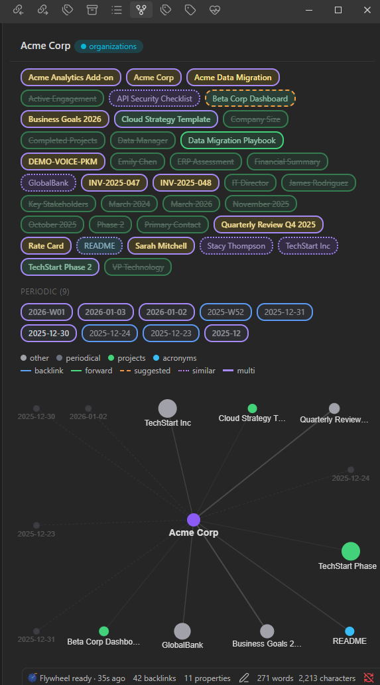
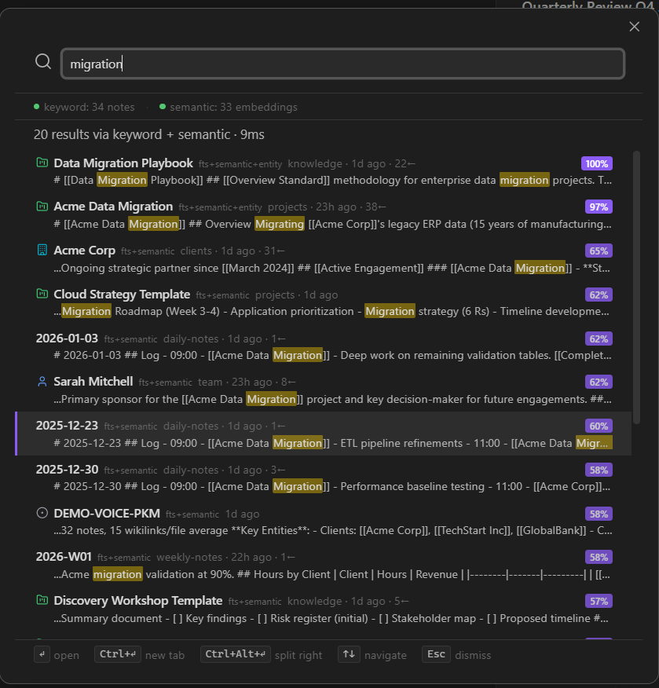
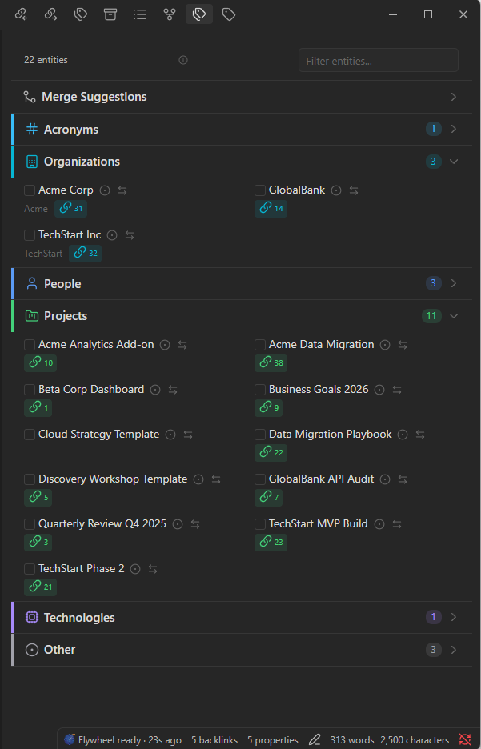
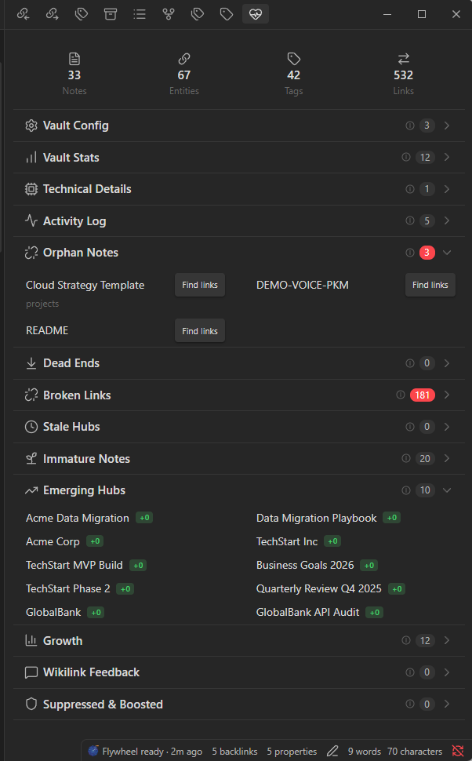

<div align="center">
  
  <h1>Flywheel Crank</h1>
  <p><strong>Graph intelligence & semantic search for your vault.</strong><br/>Obsidian plugin -- thin UI over flywheel-memory's MCP server.</p>
</div>

[](https://www.gnu.org/licenses/agpl-3.0)
[](https://obsidian.md/)
[](https://github.com/velvetmonkey/flywheel-crank)

## What is Flywheel Crank?

Flywheel Crank turns your Obsidian vault into a knowledge graph. It connects to [Flywheel Memory](https://github.com/velvetmonkey/flywheel-memory)'s MCP server to surface entity relationships, suggest wikilinks as you type, and give you semantic search across everything you've written. The more you use it, the smarter its suggestions get -- a flywheel that compounds over time.

## Screenshots

<details open>
<summary><strong>Wikilink Suggestions in Action</strong></summary>

https://github.com/user-attachments/assets/67abebec-fa2f-4c0a-be9d-e6d4958ffe86

</details>

<table>
  <tr>
    <td align="center"><a href="screenshots/graph-sidebar.png"></a><br/><sub>Graph Sidebar</sub></td>
    <td align="center"><a href="screenshots/search-modal.png"></a><br/><sub>Semantic Search</sub></td>
  </tr>
  <tr>
    <td align="center"><a href="screenshots/entity-browser.png"></a><br/><sub>Entity Browser</sub></td>
    <td align="center"><a href="screenshots/vault-health.png"></a><br/><sub>Vault Health</sub></td>
  </tr>
</table>

## Features

### Search & Discovery

- **Semantic search modal** -- Hybrid search (BM25 + embeddings) across your entire vault
- **Wikilink completions** -- Editor completions powered by the entity index and scoring engine
- **Inline suggestions** -- Context-aware wikilink suggestions as you type

### Graph & Connections

- **Graph sidebar** -- Interactive graph visualization of your vault's link structure
- **Connection explorer** -- Discover paths and relationships between entities

### Entity Intelligence

- **Entity browser** -- Browse and explore extracted entities across all categories
- **Entity page** -- Deep-dive view for any entity: backlinks, co-occurrence, feedback history
- **Batch entity moves** -- Individual and bulk entity moves across categories

### Vault Analytics

- **Vault health** -- Diagnostics for orphans, broken links, and vault stats
- **Weekly digest** -- Summary of vault activity and emerging patterns
- **Task dashboard** -- Query and visualize tasks across your vault
- **Version display** -- Crank and server versions shown in Vault Health

### Feedback Loop

- **Context menu feedback** -- Right-click to approve or reject wikilink suggestions
- **Status bar pulse** -- Live connection status and index freshness indicator
- **Auto-reconnect** -- Categorized error handling with actionable status bar messages, graph collision resolution, plus a manual `reconnect` command

## Requirements

- Obsidian desktop (not mobile)
- [Node.js](https://nodejs.org/) installed (the plugin spawns the MCP server via `npx`)

## Installation

1. Copy the plugin to your vault:

```bash
cd flywheel-crank
npm install
npm run build
cp main.js manifest.json styles.css flywheel.png /path/to/vault/.obsidian/plugins/flywheel-crank/
```

2. Enable "Flywheel Crank" in Obsidian Settings > Community Plugins.

That's it. The plugin automatically downloads and runs [Flywheel Memory](https://github.com/velvetmonkey/flywheel-memory) via `npx` when it starts -- no separate server setup needed. The MCP server runs as a local child process with full access to native modules (better-sqlite3 for StateDb, embeddings, etc.).

Semantic embeddings build automatically on first startup (~23 MB model download). Once built, search and wikilink suggestions use both keywords and meaning. You can also trigger a rebuild manually via the command palette: **Flywheel Crank: Build semantic embeddings**.

## Configuration

In Obsidian Settings > Flywheel Crank:

- **Server path** -- Leave empty (recommended). The plugin launches `npx @velvetmonkey/flywheel-memory@<pinned-version>` automatically (version pinned in each release for stability). Only set this for local development (e.g., a path to a locally built `dist/index.js`).
- **Feature toggles** -- Enable/disable individual views (graph sidebar, inline suggestions, etc.)
- **Exclude folders** -- Folders to skip during indexing

## Development

```bash
npm install
npm run dev    # watch mode (rebuilds on change)
npm run build  # production build
npm run lint   # type check
npm test       # run vitest suite
```

---

Part of the [Flywheel](https://github.com/velvetmonkey/flywheel) ecosystem. Powered by [Flywheel Memory](https://github.com/velvetmonkey/flywheel-memory).

AGPL-3.0 -- see [LICENSE](./LICENSE) for details.
