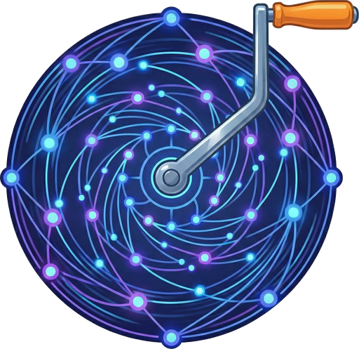
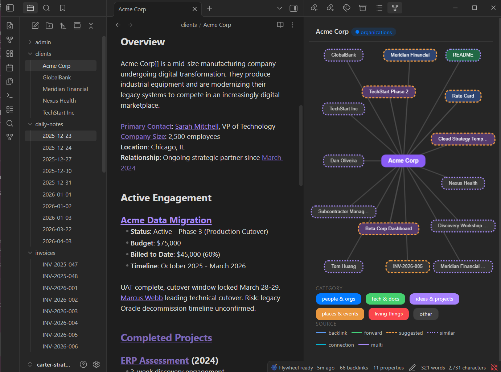
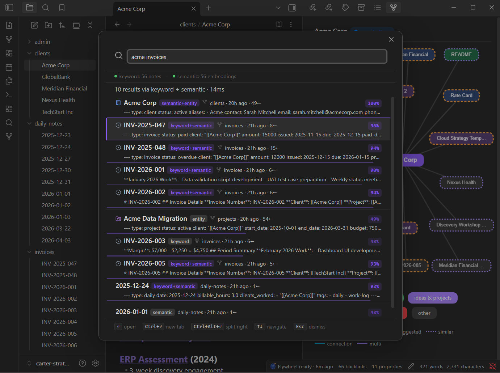

<div align="center">
  
  <h1>Flywheel Crank</h1>
  <p><strong>A window into your local vault's Flywheel MCP server.</strong><br/>Obsidian plugin — no data leaves your machine, no accounts, no sync.</p>
</div>

[](https://www.apache.org/licenses/LICENSE-2.0)
[](https://obsidian.md/)
[](https://github.com/velvetmonkey/flywheel-crank)

## What is Flywheel Crank?

Flywheel Crank is a **purely visual layer** on top of [Flywheel Memory](https://github.com/velvetmonkey/flywheel-memory), a local-only MCP server that indexes your Obsidian vault into a knowledge graph. Crank doesn't index, score, or store anything itself — it calls the MCP server over stdio and renders what comes back.

All intelligence lives in the server. Crank is the window.

### What this means in practice

| | Detail |
|---|---|
| **Architecture** | Crank → stdio → flywheel-memory (local child process) → your vault files + `.flywheel/state.db` |
| **Network** | Zero. No outbound connections, no telemetry, no cloud. The MCP server reads and writes only local files |
| **Data ownership** | Everything stays on your filesystem. The server's SQLite database (`.flywheel/state.db`) is local, inspectable, and deletable |
| **What Crank stores** | Nothing. No caches, no databases, no state beyond Obsidian's plugin settings |
| **What the server stores** | A single SQLite file per vault (`.flywheel/state.db`) — entity index, FTS5 search, feedback history, embeddings |

## Screenshots





## Features

Everything below is rendered by Crank, powered by the MCP server.

### Search & Discovery

- **Semantic search modal** — Hybrid search (BM25 + embeddings) across your entire vault
- **Wikilink completions** — Editor completions powered by the server's entity index and 13-layer scoring engine
- **Inline suggestions** — Context-aware wikilink suggestions as you type

### Graph & Connections

- **Graph sidebar** — Interactive visualization of your vault's link structure
- **Connection explorer** — Discover paths and relationships between entities

### Entity Intelligence

- **Entity browser** — Browse extracted entities across all categories
- **Entity page** — Deep-dive view: backlinks, co-occurrence, feedback history
- **Batch entity moves** — Individual and bulk entity moves across categories

### Vault Analytics

- **Vault health** — Diagnostics for orphans, broken links, and vault stats
- **Weekly digest** — Summary of vault activity and emerging patterns
- **Task dashboard** — Query and visualize tasks across your vault
- **Version display** — Crank and server versions shown in Vault Health

### Feedback Loop

- **Context menu feedback** — Right-click to approve or reject wikilink suggestions (fed back to the server's scoring engine)
- **Status bar pulse** — Live connection status and index freshness indicator
- **Auto-reconnect** — Categorized error handling with actionable status bar messages

## Requirements

- Obsidian desktop (not mobile)
- [Node.js](https://nodejs.org/) installed (the plugin spawns the MCP server via `npx`)

## Installation

1. Copy the plugin to your vault:

```bash
cd flywheel-crank
npm install
npm run build
cp main.js manifest.json styles.css flywheel.png /path/to/vault/.obsidian/plugins/flywheel-crank/
```

2. Enable "Flywheel Crank" in Obsidian Settings > Community Plugins.

That's it. The plugin automatically downloads and runs [Flywheel Memory](https://github.com/velvetmonkey/flywheel-memory) via `npx` as a **local child process** — no separate server setup, no network, no accounts. The MCP server runs with full access to native modules (better-sqlite3 for StateDb, embeddings via transformers.js).

Semantic embeddings build automatically on first startup (~23 MB model download, one-time). Once built, search and suggestions use both keywords and meaning. Rebuild manually via the command palette: **Flywheel Crank: Build semantic embeddings**.

## Configuration

In Obsidian Settings > Flywheel Crank:

- **Server path** — Leave empty (recommended). The plugin launches `npx @velvetmonkey/flywheel-memory@<pinned-version>` automatically (version pinned in each release for stability). Only set this for local development (e.g., a path to a locally built `dist/index.js`).
- **Feature toggles** — Enable/disable individual views (graph sidebar, inline suggestions, etc.)
- **Exclude folders** — Folders to skip during indexing

## Development

```bash
npm install
npm run dev    # watch mode (rebuilds on change)
npm run build  # production build
npm run lint   # type check
npm test       # run vitest suite
```

---

Part of the [Flywheel](https://github.com/velvetmonkey/flywheel) ecosystem. Powered by [Flywheel Memory](https://github.com/velvetmonkey/flywheel-memory).

Apache-2.0 — see [LICENSE](./LICENSE) for details.
